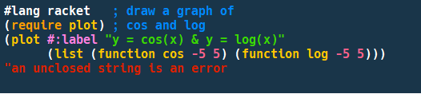

# Cobalt 2 color theme for DrRacket
This package is the Cobalt 2 color scheme for DrRacket, Racket's IDE.

## Installation

### Using Raco
1) raco pkg install https://github.com/DexterLagan/cobalt2-theme.git
2) Restart DrRacket;
3) Select the new theme in 'Edit' -> 'Preferences...' -> 'Colors' tab.

### Using the Package Manager
1) Select 'File' -> 'Install Package...' and paste the package URL (https://github.com/DexterLagan/cobalt2-theme.git);
2) Click 'Install';
3) Restart DrRacket;
4) Select the new theme in 'Edit' -> 'Preferences...' -> 'Colors' tab.

Cheers,

Dexter
